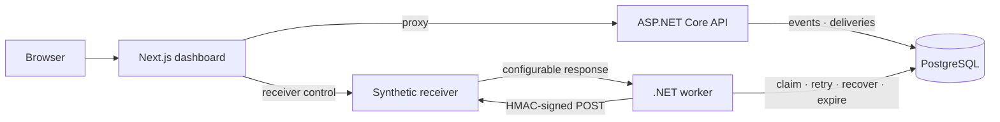

# Relay

Relay is a webhook delivery service that accepts events, signs outbound requests with HMAC-SHA256, delivers them with automatic retries, and records every attempt. A Next.js dashboard shows endpoint state, live delivery state, paginated and filtered history, attempt details, and replay controls.

The system runs locally through Docker Compose: an ASP.NET Core API, a .NET background worker, a synthetic receiver, PostgreSQL, and the dashboard.

## Architecture



Only the dashboard is published to the host at `127.0.0.1:3000`. The API, worker, receiver, and PostgreSQL communicate over the Compose network.

## Delivery flow

1. Register an active webhook endpoint with a target URL and signing secret. Disable it to stop new events and replays without cancelling work already queued; reactivate it to resume intake.
2. Submit an event with a JSON payload and idempotency key.
3. The API creates the event and a queued delivery in one transaction.
4. The worker claims the delivery, signs the envelope, and sends an HTTP POST.
5. On a retryable failure (HTTP 408, 429, 5xx, timeout, transport error), the worker schedules the next attempt with exponential backoff: 1 s, 2 s, 4 s — up to four total attempts.
6. On a non-retryable failure or after exhausting attempts, the delivery is terminal.
7. A failed delivery can be replayed manually. The replay creates a new delivery with a fresh envelope, hash, and correlation ID while preserving the event and payload.
8. Once every delivery for an event has been terminal for the retention period, the worker removes the event, its deliveries, and their attempts together.

## Signing contract

The worker signs each request with `HMAC-SHA256(secret, "v1\n{unix-seconds}\n{delivery-id}\n{body}")` and sends the result as `X-Relay-Signature: v1={base64}`. Request headers include `X-Relay-Event-Id`, `X-Relay-Delivery-Id`, `X-Relay-Timestamp`, and `X-Correlation-Id`.

The receiver validates the timestamp within a five-minute window and compares signatures in constant time. A reused delivery identifier with the same body is acknowledged; a changed body is rejected with 409.

## Run locally

Prerequisite: Docker with Docker Compose.

```sh
docker compose up --build --wait --wait-timeout 180
```

Open [http://127.0.0.1:3000](http://127.0.0.1:3000). The `migrate` container exits with code 0 after applying EF Core migrations.

```sh
docker compose ps --all    # check service state
docker compose down        # stop, preserve volumes
docker compose down -v     # stop, remove volumes
```

## Development

Requires Node.js 24, npm 11, .NET SDK 10, and Docker.

```sh
# Frontend
npm ci
npm run lint
npm run typecheck
npm test
npm run build

# Backend
dotnet restore Relay.slnx --locked-mode
dotnet build Relay.slnx -c Release --no-restore
dotnet test tests/Relay.UnitTests -c Release --no-build
dotnet test tests/Relay.IntegrationTests -c Release --no-build

# End-to-end (requires running Compose stack)
npx playwright install --with-deps chromium
docker compose up --build --wait --wait-timeout 180
npm run test:e2e
```

Integration tests start disposable PostgreSQL containers through Testcontainers. Four Playwright tests cover immediate success with endpoint lifecycle, filtering, and history pagination; retry-then-success; failed-delivery replay; and event validation, loading, error, and recovery states through the dashboard.

## Retention

The worker checks for expired event groups once per hour and removes at most 100 per pass. The default retention period is 30 days. A group is kept if any original or replay delivery is queued, processing, retry-scheduled, incomplete, or newer than the cutoff.

The settings are under `Relay:DeliveryRetention`. Compose overrides use `Relay__DeliveryRetention__Enabled`, `Relay__DeliveryRetention__RetainFor`, and `Relay__DeliveryRetention__CleanupInterval`; durations use the .NET `TimeSpan` format. Retention removes the event payload and idempotency record along with its delivery history. Endpoints are not removed.

## Security boundary

- Endpoint URLs must match the configured receiver origin and `/webhooks/{UUID}` path.
- Stored signing keys are protected with ASP.NET Core Data Protection; API and worker share an uncommitted key-ring volume.
- Correlation IDs and delivery metadata are logged as structured data without payloads, signatures, or keys.
- Relay has no authentication and must remain on an isolated local network.

## Limitations

- Receiver state is in-memory and resets when the container restarts.
- No arbitrary webhook destinations, authentication, multitenancy, billing, or cloud deployment.

## Repository layout

| Directory | Purpose |
|-----------|---------|
| `apps/dashboard` | Next.js dashboard and Vitest tests |
| `src/Relay.Api` | Event, endpoint, delivery, and replay HTTP API |
| `src/Relay.Core` | Domain entities, state machine, retry policy, signing |
| `src/Relay.Infrastructure` | EF Core persistence and migrations |
| `src/Relay.Worker` | Claim loop, delivery, retry scheduling, stale-claim recovery, retention cleanup |
| `tools/Relay.ReceiverSimulator` | Configurable synthetic receiver |
| `tests/Relay.UnitTests` | Domain and signing unit tests |
| `tests/Relay.IntegrationTests` | API, worker, receiver, and PostgreSQL tests |
| `tests/e2e` | Playwright delivery workflows |
| `docs/` | [Status](docs/STATUS.md), [decisions](docs/DECISIONS.md), [roadmap](docs/ROADMAP.md) |
